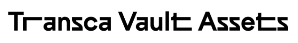

**Whitepaper** 

August - 2023

**Abstract and Background**

Recently, the phrase “Real World Assets” has been the hot topic of the blockchain market as evidenced by the fact that RWAs are consistently mentioned by various Layer 1 and Layer 2 blockchains, hackathon competitions, grants programming, and so on. So, what exactly are the “Real World Assets”? (for short RWAs)

Real World Assets are essentially physical assets such as gold, commodities, or anything tangible or intangible that are tokenized in the form of tokens or NFTs. This type of tokenization aims to drive the development of the Defi market in the blockchain, makes it simple for users to trade the goods that they own on the blockchain platform, and attracts cash flow from non-crypto users to the crypto market (from Web 2.0 to Web 3.0). Some of the RWAs that are easily recognizable at present include:

- USDT, USDC,... (Stablecoin): It is the real-life $USD tokenized into tokens for trading on Defi platforms at the present time. For instance, if you want to mint 1,000,000 USDT or USDC, you have to lock 1,000,000 USD in reality.
- PAX Gold (PAXG): Gold is also tokenized on the blockchain.

In addition to the common RWAs mentioned above, there are also quite a few projects about RWAs in the market such as:

- Centrifuge: This is one of the pioneering projects in the encryption of Real World Assets. There are 2 Defi projects on Centrifuge: AAVE and MakerDAO. Centrifuge allows anyone to launch an on-chain credit fund, and create collateralized loans.
- RealT: This is a platform that supports tokenizing and fractionalizing real estate into RWA tokens. Currently, RealT is tokenizing real estate in the United States, allowing investors around the world to own real estate for as little as $50. By March 2023, RealT had tokenized a property worth more than $70 million and attracted more than 14,000 investors.

The tokenization of Real World Assets holds potential for transforming traditional financial systems into more efficient and accessible blockchain-based ecosystems.

So here we need to pose a question: Why do all RWAs revolve around gold, USD, diamonds, rather than other commodities? We can clearly see that items like gold, USD, and diamonds have high liquidity, which can minimize risks when the project owner is responsible for liquidizing the tokenized assets (USDT, USDC, PAX Gold). And thereby we can understand why they only deal with Tokens rather than NFTs. Because the flexibility of NFTs is not as high as Tokens. For instance, you can trade 0.1 USDT for BTC, but you can't trade 0.1 NFT for BTC.

In this project, Transca Vault will provide a solution to address that issue. Transca Vault is a platform that enables users to bring Real World Assets into the blockchain in the form of NFTs.

1. **About Transca Vault** 

Transca Vault is conceptualized from theoretical points related to feasibility, legal aspects, insurance, and so on. It takes the advantage of the decentralization of blockchain platforms to bring value and utility to users. Transca Vault allows users to bring physical assets into the blockchain in the form of NFTs. A physical asset NFT is a unique digital token that represents ownership of a physical object, such as a piece of art, a collectible, or even real estate. This process enables the tokenization of physical assets, enabling them to be exchanged, sold, and possessed just like digital assets. These physical asset NFTs are securely stored on a blockchain, which provides a safe, decentralized, and unalterable ledger of ownership and transactions.

In this project, we will identify the NFTs category into two main types:

- High liquidity NFT class: such as gold, diamonds, carbon credits - these are assets that can be clearly valued through Oracles.
- Low liquidity NFT class: such as fashion items, watches, other commodities, etc. Transca enables users to set their own prices through the process of adding assets into the Transca vault. This “user\_define\_price” will be determined by the user. Alternatively, users can also utilize Transca's service to connect with the appraisal party to get a more accurate assessment of the current value of their assets, which is known as “appraisal\_price”

The assets that users deposit into the Transca vault will be safeguarded according to defined security measures and insurance policies. Transca offers some services such as NFT bundle and fractionalizing NFTs to enhance their practical utility in DeFi activities. Additionally, Transca provides DeFi services such as lending and borrowing for the RWAs NFTs that have been minted.

Transca Vault is conceptualized from theoretical points related to feasibility, legal aspects, insurance, and so on. It takes the advantage of the decentralization of blockchain platforms to bring value and utility to users. 
## **1.1 - Decentralization and freedom are always aspirations of people**
The essence of “Decentralization” is simply a term describing the opposite side of "Centralization”. Centralized networks are owned and operated by a single entity, while Decentralized networks are spread out and owned by multiple entities. Decentralized networks are also more democratic, as decisions are made by consensus instead of by a single authority. Moreover, the characteristic of Decentralization creates differentiation and value for the blockchain network. It's easier to understand in the context of multiple entities (Decentralization) having the right to make decisions instead of single entity (Centralization) making decisions. It helps to reduce the control of any individual or group. As a result, individual rights are better guaranteed because everyone can observe the activities of each person in the decentralized network, and it helps to prevent fraud for group benefits.
## **1.2 - Everything can be tokenized**
Similar to the web 2.0 market, we alo have the stock market. So we raise the question: Why is there a price for gold on the stock market? The answer is gold has been tokenized into an identifier per unit and assigned a value to that unit. Therefore, we can do the same with web 3.0 by focusing on the Decentralized foundation of blockchain as the core principle. For the DeFi market in Web 3.0, Transca chooses NFTs as a solution to tokenizing Real World Assets, anh Oracle system is chosen to determine the valuation of the assets. Through the benefits of NFT and Oracle, we can completely add anything on the blockchain and assign value to them, not just limited to converting gold, diamonds, and USD into Tokens. 
## **1.3 - NFT is a core part of financial models**
In the realm of financial innovation, Non-Fungible Tokens (NFTs) have emerged as a core element. These unique digital assets, characterized by their scarcity and individuality, hold the potential to reshape traditional finance. In this context, we would like to emphasize the significance of the NFTs that have a limited quantity and rarity. Specifically, the NFTs will represent as a tangible asset, which means the quantity and rarity of physical commodities will correspond to the number and rarity of NFTs. 
## **1.4 - NFT in the present time**
We cannot deny the value that NFT brings in the present time. They hold tremendous value, especially in fields such as art and game-fi. When you possess an NFT, you genuinely own the associated asset. According to the above utilities, we can create NFTs equivalent to value certificates, which can be used directly on Defi platforms, not just Token.

1. **Challenges and limitations** 

There are numerous challenges in creating an RWAs platform:

- Physical vault: Establishing a physical vault for storing real-world assets has always been a dilemma in the context of web 2.0. Creating a physical vault is like setting up a private bank under strict government regulation. Because it directly affects the economy, monetary policies, and assets. In order to prevent market manipulation and fraud,  the bank requires an escrow minimum capital to enhance the liquidity & security of the bank.

- Security: Security here isn't just limited to technology and technical aspects; it also extends to real-world security concerns. Users who hold onto a real-world asset always involve a number of hidden risks such as theft, natural disasters, fires, etc. Therefore, we have to enhance the security measures and utilize the insurance policies to ensure the protection of assets.

- Legal: In some countries, legal regulations can be a limiting factor for the development of blockchain technology. Legal regulations create obstacles to tokenize assets such as land and vehicles. Most countries in the world have no policies to protect blockchain users as well as businesses building applications on the blockchain platform. However,  there are some pioneering countries such as Switzerland and America that have their own policy regarding tax and user protection to support the business related to blockchain.

- The societal acceptance of blockchain technology: The limitations imposed by legal frameworks and society's understanding of blockchain technology are the fundamental elements that determine user acceptance. Furthermore, the increasing number of numerous projects that constantly introduce new concepts to mislead users and against the trust in the market. As a result, it also impacts the high-quality projects that create value for users and society.

1. **The Transca Platform**

**3.1 -  Real Vault Assets and Vault Management**

- Real Vault Assets

Transca Vault Assets will be a physical warehouse that complies with all the legal regulation and sufficient insurance coverage for the safeguarding of users' assets and commodities. It also involves the development of a management system overseeing multiple vaults to sync data, strictly managing the security and the supply source of commodities before tokenization. Furthermore, the outstanding attention is given to providing users with optimal legal and insurance safeguards for their assets. 

- Vault Management

NFT RWAs management aims to ensure security and reality. By ensuring the supply of user's physical assets, Transca Vault management will provide real-time supply information of the assets held by Transca Vault. This will be managed through the Oracle system to oversee the minting and burning of NFTs (equivalent value certificates) in a controlled manner. This approach prevents misuse, excessive minting, and burning that could disrupt the balance and affect the financial mechanisms in place.

Furthermore, in order to ensure the transparency of the NFTs supply, Transca takes the responsibility to manage the actual quantity of assets that users deposit into the vault. We utilize the Oracle system to strictly control over the process of minting an NFT. Additionally, if an asset is not stored in the vault, the NFT will be immediately burned to maintain the integrity of the system. This approach ensures that NFTs are only minted when there is a legitimate corresponding physical asset in the vault. For instance, if an NFT representing one gram of gold is minted, it must be ensured that Transca Vault is actually holding one gram of gold. 

The following diagram depicts the Transca Vault Management system, providing an illustration of how the vaults function.

 Figure 1: Diagram of Transca Vault Management system
## **3.2 -  Asset to NFT**

Figure 2: Diagram of Converting Asset into NFT

The process of transforming RWAs to NFTs starts with the adding of the physical assets in the vault. Then, Transca will tokenize the assets and provide equivalent value certificates, then transform them into NFTs. These NFTs’value will be evaluated by using Oracle, and according to various standards such as ERC-721, ERC-20, ERC-1155, ERC-6551, etc.). After the process of validation, the real assets of users will be securely stored in the Transca Vault and protected by the measures implemented by Transca. 

For instance, if a user deposits a 1-carat diamond into the vault, Transca Vault will issue an NFT (equivalent value certificate) with metadata about the diamond's characteristics such as identifier code, weight, appearance. When the user wants to retrieve their asset, they simply return the NFT to Transca Vault. During that time,  the user's diamond will be stored, managed, and safeguarded by the vault and its insurance policies. Similarly, when a user deposits a watch into the vault, Transca Vault will provide an NFT. The user can choose to define a price using the "User\_Define\_Price" feature, which allows them to set a value for their assets. Alternatively, the user can request Transca to connect with appraisal services to obtain a more accurate valuation for their asset. This approach offers flexibility and security for different types of assets held within the Transca ecosystem.

Moreover, Transca will support practically all types of commodities, including those with high and low market liquidity. Transca will leverage NFTs' characteristics to evaluate the value and create Commodity Identifiers (Identifier code) to precisely determine which asset is placed in the vault in order to assist users in finding the right assets upon withdrawal.

When a user wishes to reclaim their physical asset, they can simply return the NFT (equivalent value certificate provided by Transca) to retrieve ownership of their property. Each tokenized asset will have a specific time limit. To ensure asset protection for users, Transca will charge a fee that will be imposed for asset protection (insurance purchase, authentication, verification, storage). If the time limit expires, users will need to pay a renewal fee.
## **3.3 - NFT Bundle and NFT Split**
- NFT Bundle

This is a solution that allows users to combine multiple RWAs NFTs into a single package - a unique RWAs NFT which has an overall value equal to the sum of the individual RWA NFT's values. The purpose of this is to create a NFTs package and minimize the number of transactions that users need to make when using RWA NFTs in financial platforms. Furthermore, users can take the advantage of adjusting the number of NFTs used to generate the package and putting it into an RWA NFT Bundle.

Figure 3: Diagram of Converting multiple NFTs into 1 bundle & Unpacking a bundle into multiple NFTs

- NFT Split

NFT Split is also a solution that enables users to divide their NFTs into several parts and use them in DeFi activities. For instance, if a user deposits 5 grams of gold into the vault, how can they use just one gram of gold for DeFi activities? NFT Split addresses this issue. When the user wants to reclaim the original RWA NFT, they can take it from the pieces that were split initially. As a result, this feature allows the user to retrieve the original NFT. 

This also addresses the reason why other platforms only support Tokens instead of NFTs, because they see that Token decimals can be divided into smaller units for usage. With NFT Split, we can achieve a similar outcome even with NFTs.

Figure 4: Diagram of Splitting 1 NFT into component NFTs & Concatenation component NFTs into 1 NFT
## 	**3.5 - Lending and Borrowing**
There are 2 types of Lending depending on the asset type of the user. Users will use RWAs NFT to borrow USDT/ USDC for a certain period of time such as 1 month, 3 months, 6 months,.... and each period will have a different interest rate. When the loan is overdue, the system will allow the user to extend the duration or not. If the user is unable to pay the loan, the user's NFT will belong to the lender, and that means that the asset in the Transca Vault will belong to the lender.
## 
Figure 5: Diagram of Lending and Borrowing

Transca vault provides 2 different ways to lend and borrow of High/Low Liquidity Assets:

- For high liquidity assets: Transca will directly liquidate highly liquidity assets such as gold and diamonds. Transca will allow users to borrow directly these assets in USDT, USDC, or BTC, based on the valuation provided by Oracle with specified interest rates.

Figure 6: Diagram of Lending and Borrowing NFT of High Liquidity Class

- For low liquidity assets: Transca will not directly facilitate liquidity for these types of assets (such as fashion clothes, art,...). Instead, Transca will provide social matching services between borrowers and lenders in order to create a community which aims at enhancing the liquidity of user assets. This approach fosters a network where users can find potential lenders or borrowers for their specific assets, increasing the overall liquidity of these less liquid asset classes.

Figure 7: Diagram of Lending and Borrowing NFT of Low Liquidity Class
## **3.6 - Staking**
By staking RWAs NFTs with highly liquidity assets like gold and diamonds, users are contributing to increasing Transca's liquidity. As a result, users will receive interest based on the value of the staked RWAs NFTs.
## **3.7 - Governance and Reward for partner**
Transca will not create a governance token, but it will utilize the user's RWAs NFT to create Governance in order to vote for Transca's features and important decisions. Users who are Staking RWAs NFT for more than 1 year will have the right to vote in Transca's platform and get a percentage of the profit divided according to the value of those NFT RWAs.
## **3.8 - Alerts and Notification system**
The alerts and notification system will directly inform users about important news via email, application such as loan maturity deadlines, etc in order to improve the user experience with Transca's services.

**3.9 - Scale by Escrow**

Transca Vault will be scaled in the form of escrow that anyone can establish a Vault if they can meet the conditions set by Transca. Below are some basic conditions that users must follow if they want to run their own vault: 

- The branch must lock a particular amount of USDT, USDC, BTC, etc. (e.g., 5,000,000 USDT) into Transca's vault. If a branch decides to discontinue cooperation, they must return all the assets back to Transca Vault or to another designated location.
- The branch is required to adhere to insurance regulations for asset protection in order to increase the safety and security of users' commodities

Profits will be distributed to the branch through their business operations and the profits they make.

.

**4. Conclusion** 

The rise of marketplaces for Real World Assets is a significant step forward for the world of digital assets and opens up a whole new world of possibilities for artists, collectors, investors, and consumers.  However, there are numerous challenges and obstacles in developing Real World Assets. Therefore, Transca's platform offers a comprehensive range of solutions for RWAs that aligns with the principles of Web 3.0, where ownership, control, and financial interactions can be seamlessly conducted in a secure and efficient manner. Moreover, it is also addressing a portion of the liquidity challenges for various assets, establishing a DeFi market with collateralized assets, enhancing transparency, and providing utility for users from Web 2.0 to Web 3.0.

Compared to the current DeFi solutions in the crypto market as well as traditional CeFi solutions, Transca aims to offer optimized and scalable solutions to address liquidity challenges for RWAs NFTs in a transparent and clear manner. Users truly own their assets and have the authority to make decisions over them swiftly and cost-effectively. Transca's platform also creates a specialized social network for DeFi, facilitating the resolution of lending and borrowing processes. This approach aims to streamline communication and interaction between borrowers and lenders, promoting a more efficient and secure lending ecosystem. 

